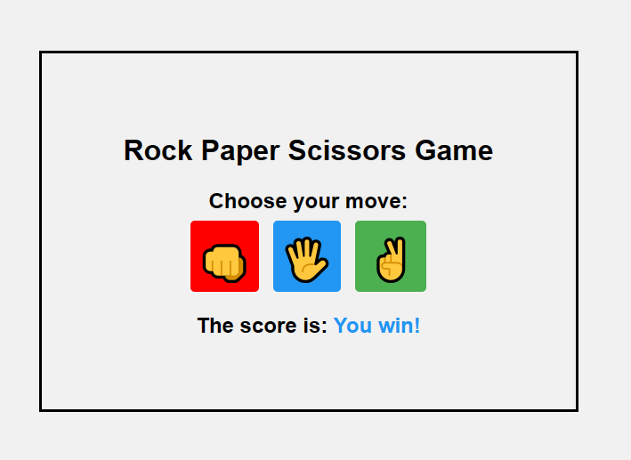

# Rock-Paper-Scissors

## Description
A simple Javascript game of rock, paper and scissors.
The player chooses either "Rock", "Paper" or "Scissors". Then the
computer randomly selects one among these options as well. The winner is determined if the user choice matches the computer choice.

